# Database Schema Documentation

This document describes the database schema for the Task Manager application. The schema is built with PostgreSQL and managed by Prisma ORM.

## Overview

- **Database Provider**: PostgreSQL
- **ORM**: Prisma
- **ID Type**: CUID (globally unique identifiers)

## Conventions

- **Logical vs Physical names**: Model field names shown in this document are logical Prisma names. Some fields are mapped to different physical DB column names using `@map` (for example, `creatorId` → `ownerId`).
- **PK/Unique notation**: Primary keys are labeled `PK`; separate `Unique` labels are only used for non-primary unique constraints (for example, `User.email`).
- **Many-to-many notation**: For implicit Prisma many-to-many relations, this document references the implicit join table naming pattern (for example, `_TaskLabels`) rather than introducing an explicit model.
- **ERD scope**: The ERD is a conceptual relationship view generated from Prisma models; model sections below remain the authoritative field-level reference.

## Entity Relationship Diagram

> Source: Prisma models in `server/prisma/models/*.prisma`  
> Regenerate diagram: `npm run docs:erd`  
> This ERD is a clean conceptual view for readability. Full field-level details are documented in the model tables below.

## Models

### User

Represents a user in the system.

| Field      | Type     | Constraints    | Description               |
| ---------- | -------- | -------------- | ------------------------- |
| id         | String   | PK             | Unique identifier (cuid)  |
| email      | String   | Unique         | User's email              |
| givenName  | String   | VarChar(255)   | First name                |
| familyName | String   | VarChar(255)   | Last name                 |
| avatarUrl  | String?  | Optional       | Optional avatar image URL |
| createdAt  | DateTime | Default: now() | Account creation time     |
| updatedAt  | DateTime | Auto-updated   | Last update timestamp     |

**Relations:**

_See [Conventions](#conventions) for naming and relation notation._

- One-to-Many with `Project` (creator)
- One-to-Many with `Task` (creator)
- One-to-Many with `Label`
- One-to-Many with `Status`
- One-to-Many with `Priority`
- One-to-Many with `Role`

---

### Project

A container for organizing related tasks.

| Field       | Type      | Constraints    | Description                        |
| ----------- | --------- | -------------- | ---------------------------------- |
| id          | String    | PK             | Unique identifier (cuid)           |
| title       | String    | VarChar(255)   | Project name                       |
| description | String?   | VarChar(1000)  | Optional project description       |
| creatorId   | String    | Foreign Key    | Owner user ID (DB column: ownerId) |
| startDate   | DateTime? | Optional       | Project start date                 |
| endDate     | DateTime? | Optional       | Project end date                   |
| createdAt   | DateTime  | Default: now() | Creation timestamp                 |
| updatedAt   | DateTime  | Auto-updated   | Last update timestamp              |

**Relations:**

_See [Conventions](#conventions) for naming and relation notation._

- Many-to-One with `User` (creator)

---

### Task

The core entity representing a work item. Tasks can be nested recursively (unlimited depth) for subtasks.

| Field          | Type      | Constraints    | Description               |
| -------------- | --------- | -------------- | ------------------------- |
| id             | String    | PK             | Unique identifier (cuid)  |
| title          | String    | VarChar(255)   | Task title                |
| description    | String?   | VarChar(1000)  | Detailed task description |
| parentId       | String?   | Foreign Key    | Parent task for subtasks  |
| creatorId      | String    | Foreign Key    | User who created the task |
| priorityId     | String?   | Foreign Key    | Associated priority       |
| statusId       | String?   | Foreign Key    | Associated status         |
| startDate      | DateTime? | Optional       | Task start date           |
| dueDate        | DateTime? | Optional       | Due date                  |
| estimatedHours | Float?    | Optional       | Estimated effort in hours |
| createdAt      | DateTime  | Default: now() | Creation timestamp        |
| updatedAt      | DateTime  | Auto-updated   | Last update timestamp     |

**Relations:**

_See [Conventions](#conventions) for naming and relation notation._

- Many-to-One with `User` (creator)
- Many-to-One with `Task` (self-referencing parent)
- One-to-Many with `Task` (subtasks)
- Many-to-One with `Priority`
- Many-to-One with `Status`
- Many-to-Many with `Label` (via Prisma implicit join table, e.g. `_TaskLabels`)

---

### Status

Categorization status that can be applied to Tasks.

| Field     | Type     | Constraints    | Description                        |
| --------- | -------- | -------------- | ---------------------------------- |
| id        | String   | PK             | Unique identifier (cuid)           |
| name      | String   |                | Status name                        |
| color     | String   |                | Hex color code                     |
| creatorId | String   | Foreign Key    | Owner user ID (DB column: ownerId) |
| createdAt | DateTime | Default: now() | Creation timestamp                 |
| updatedAt | DateTime | Auto-updated   | Last update timestamp              |

**Relations:**

_See [Conventions](#conventions) for naming and relation notation._

- Many-to-One with `User` (creator)
- One-to-Many with `Task`

---

### Priority

Priority level that can be applied to Tasks.

| Field     | Type     | Constraints    | Description                        |
| --------- | -------- | -------------- | ---------------------------------- |
| id        | String   | PK             | Unique identifier (cuid)           |
| name      | String   |                | Priority name                      |
| color     | String   |                | Hex color code                     |
| creatorId | String   | Foreign Key    | Owner user ID (DB column: ownerId) |
| createdAt | DateTime | Default: now() | Creation timestamp                 |
| updatedAt | DateTime | Auto-updated   | Last update timestamp              |

**Relations:**

_See [Conventions](#conventions) for naming and relation notation._

- Many-to-One with `User` (creator)
- One-to-Many with `Task`

---

### Label

Labels that can be applied to Tasks for categorization.

| Field     | Type     | Constraints    | Description                        |
| --------- | -------- | -------------- | ---------------------------------- |
| id        | String   | PK             | Unique identifier (cuid)           |
| name      | String   |                | Label name                         |
| color     | String   |                | Hex color code                     |
| creatorId | String   | Foreign Key    | Owner user ID (DB column: ownerId) |
| createdAt | DateTime | Default: now() | Creation timestamp                 |
| updatedAt | DateTime | Auto-updated   | Last update timestamp              |

**Relations:**

_See [Conventions](#conventions) for naming and relation notation._

- Many-to-One with `User` (creator)
- Many-to-Many with `Task` (via Prisma implicit join table, e.g. `_TaskLabels`)

---

### Role

Roles that can be applied to Users (future feature).

| Field     | Type     | Constraints    | Description                        |
| --------- | -------- | -------------- | ---------------------------------- |
| id        | String   | PK             | Unique identifier (cuid)           |
| name      | String   |                | Role name                          |
| color     | String   |                | Hex color code                     |
| creatorId | String   | Foreign Key    | Owner user ID (DB column: ownerId) |
| createdAt | DateTime | Default: now() | Creation timestamp                 |
| updatedAt | DateTime | Auto-updated   | Last update timestamp              |

**Relations:**

_See [Conventions](#conventions) for naming and relation notation._

- Many-to-One with `User` (creator)

---

## Key Features

1. **Recursive Task Hierarchy**: Tasks support unlimited nesting via self-referencing `parentId` field
2. **User-Owned Entities**: All customizable entities (Status, Priority, Label, Role) are owned by users
3. **Many-to-Many Labels**: Tasks can have multiple labels via implicit relation
4. **Timestamps**: All models include `createdAt` and `updatedAt` fields
