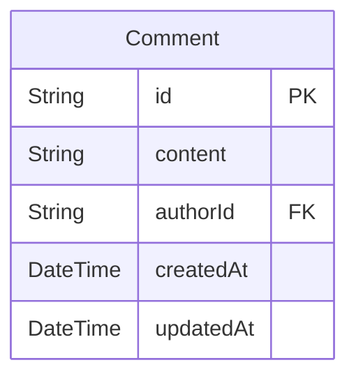
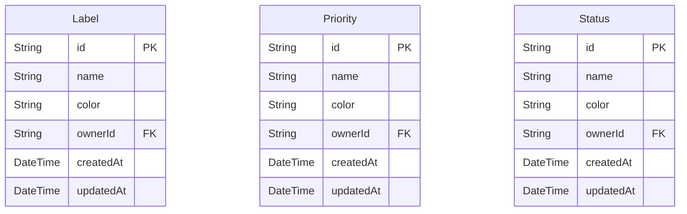
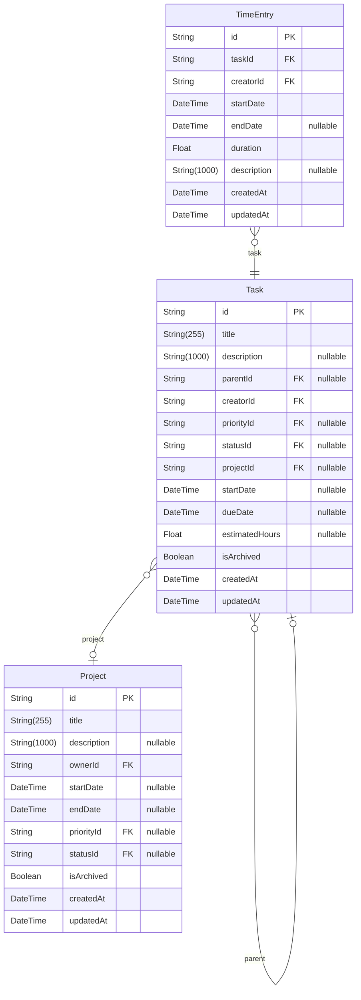
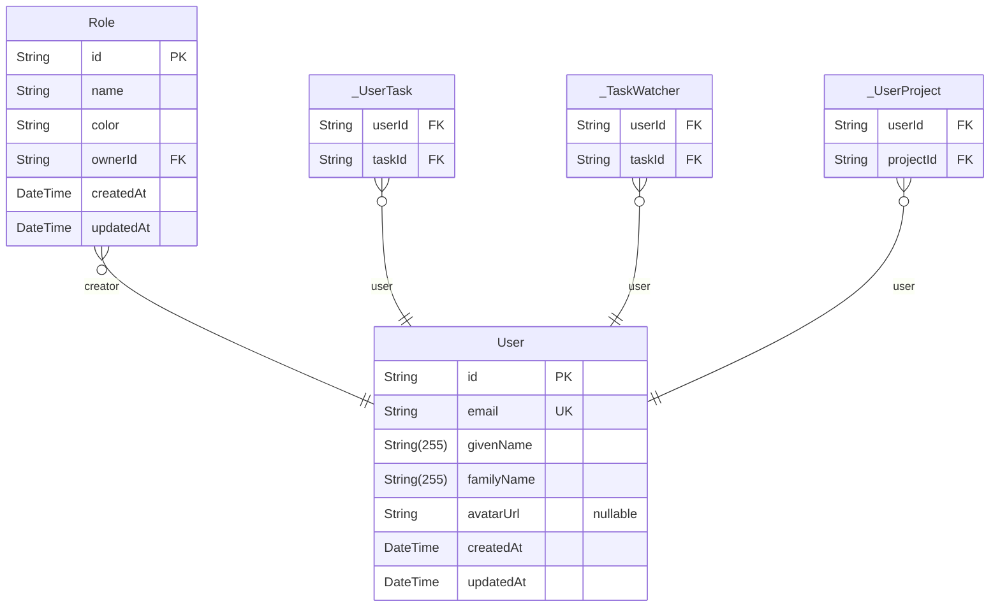
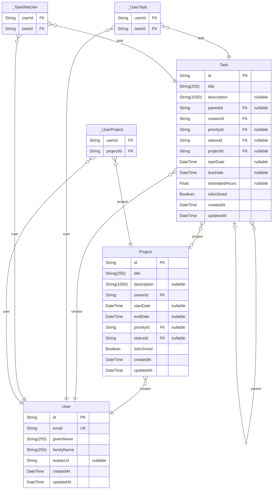
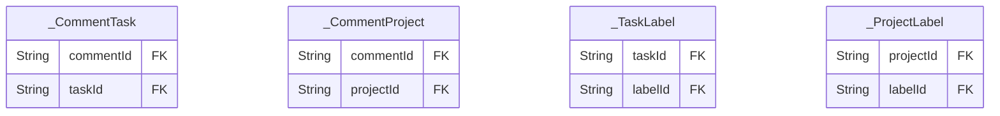

# Task Manager Database Schema

> Generated by [`prisma-markdown`](https://github.com/samchon/prisma-markdown)

- [Communication](#communication)
- [Taxonomy](#taxonomy)
- [Work](#work)
- [Core](#core)
- [Overview](#overview)
- [default](#default)

## Communication

```mermaid
erDiagram
"Comment" {
  String id PK
  String content
  String authorId FK
  DateTime createdAt
  DateTime updatedAt
}
```

### `Comment`

Represent a comment on a task or a project.

Properties as follows:

- `id`: Comment identifier (CUID).
- `content`: Comment content.
- `authorId`: Author user identifier (mapped to `creatorId`).
- `createdAt`: Creation timestamp.
- `updatedAt`: Last update timestamp.

## Taxonomy

```mermaid
erDiagram
"Label" {
  String id PK
  String name
  String color
  String ownerId FK
  DateTime createdAt
  DateTime updatedAt
}
"Priority" {
  String id PK
  String name
  String color
  String ownerId FK
  DateTime createdAt
  DateTime updatedAt
}
"Status" {
  String id PK
  String name
  String color
  String ownerId FK
  DateTime createdAt
  DateTime updatedAt
}
```

### `Label`

Represents a reusable label for task categorization.

Properties as follows:

- `id`: Label identifier (CUID).
- `name`: Label display name.
- `color`: Label color (hex code).
- `ownerId`: Owner user identifier (mapped to `ownerId`).
- `createdAt`: Creation timestamp.
- `updatedAt`: Last update timestamp.

### `Priority`

Represents a reusable task priority.

Properties as follows:

- `id`: Priority identifier (CUID).
- `name`: Priority display name.
- `color`: Priority color (hex code).
- `ownerId`: Owner user identifier (mapped to `ownerId`).
- `createdAt`: Creation timestamp.
- `updatedAt`: Last update timestamp.

### `Status`

Represents a reusable task status.

Properties as follows:

- `id`: Status identifier (CUID).
- `name`: Status display name.
- `color`: Status color (hex code).
- `ownerId`: Owner user identifier (mapped to `ownerId`).
- `createdAt`: Creation timestamp.
- `updatedAt`: Last update timestamp.

## Work

```mermaid
erDiagram
"Project" {
  String id PK
  String(255) title
  String(1000) description "nullable"
  String ownerId FK
  DateTime startDate "nullable"
  DateTime endDate "nullable"
  String priorityId FK "nullable"
  String statusId FK "nullable"
  Boolean isArchived
  DateTime createdAt
  DateTime updatedAt
}
"Task" {
  String id PK
  String(255) title
  String(1000) description "nullable"
  String parentId FK "nullable"
  String creatorId FK
  String priorityId FK "nullable"
  String statusId FK "nullable"
  String projectId FK "nullable"
  DateTime startDate "nullable"
  DateTime dueDate "nullable"
  Float estimatedHours "nullable"
  Boolean isArchived
  DateTime createdAt
  DateTime updatedAt
}
"TimeEntry" {
  String id PK
  String taskId FK
  String creatorId FK
  DateTime startDate
  DateTime endDate "nullable"
  Float duration
  String(1000) description "nullable"
  DateTime createdAt
  DateTime updatedAt
}
"Task" }o--o| "Task" : parent
"Task" }o--o| "Project" : project
"TimeEntry" }o--|| "Task" : task
```

### `Project`

Represents a project that groups related tasks.

Properties as follows:

- `id`: Project identifier (CUID).
- `title`: Project title.
- `description`: Optional project description.
- `ownerId`: Owner user identifier (mapped to `ownerId`).
- `startDate`: Optional project start date.
- `endDate`: Optional project end date.
- `priorityId`: Priority identifier.
- `statusId`: Status identifier.
- `isArchived`: archived status.
- `createdAt`: Creation timestamp.
- `updatedAt`: Last update timestamp.

### `Task`

Represents a task work item.
Supports recursive nesting through parent-child relationships.

Properties as follows:

- `id`: Task identifier (CUID).
- `title`: Task title.
- `description`: Optional task description.
- `parentId`: Parent task identifier.
- `creatorId`: Creator user identifier.
- `priorityId`: Priority identifier.
- `statusId`: Status identifier.
- `projectId`: Projects associated with this task.
- `startDate`: Optional task start date.
- `dueDate`: Optional task due date.
- `estimatedHours`: Optional estimated effort in hours.
- `isArchived`: archived status.
- `createdAt`: Creation timestamp.
- `updatedAt`: Last update timestamp.

### `TimeEntry`

Represents a time entry for tracking work on a task.

Properties as follows:

- `id`: Time entry identifier (CUID).
- `taskId`: Associated task identifier.
- `creatorId`: User who logged the time entry.
- `startDate`: Start timestamp of the time entry.
- `endDate`: End timestamp of the time entry (null if running).
- `duration`: Duration of the time entry in hours.
- `description`: Optional description of the time entry.
- `createdAt`: Timestamp when the time entry was created.
- `updatedAt`: Last update timestamp.

## Core

```mermaid
erDiagram
"Role" {
  String id PK
  String name
  String color
  String ownerId FK
  DateTime createdAt
  DateTime updatedAt
}
"User" {
  String id PK
  String email UK
  String(255) givenName
  String(255) familyName
  String avatarUrl "nullable"
  DateTime createdAt
  DateTime updatedAt
}
"_UserTask" {
  String userId FK
  String taskId FK
}
"_TaskWatcher" {
  String userId FK
  String taskId FK
}
"_UserProject" {
  String userId FK
  String projectId FK
}
"Role" }o--|| "User" : creator
"_UserTask" }o--|| "User" : user
"_TaskWatcher" }o--|| "User" : user
"_UserProject" }o--|| "User" : user
```

### `Role`

Represents a role definition for future access control.

Properties as follows:

- `id`: Role identifier (CUID).
- `name`: Role display name.
- `color`: Role color (hex code).
- `ownerId`: Owner user identifier (mapped to `ownerId`).
- `createdAt`: Creation timestamp.
- `updatedAt`: Last update timestamp.

### `User`

Represents an application user.

Properties as follows:

- `id`: User identifier (CUID).
- `email`: User email address.
- `givenName`: Given name.
- `familyName`: Family name.
- `avatarUrl`: Optional avatar image URL.
- `createdAt`: Creation timestamp.
- `updatedAt`: Last update timestamp.

### `_UserTask`

Represents the many-to-many relationship between users and tasks for task assignments.

Properties as follows:

- `userId`: User identifier.
- `taskId`: Task identifier.

### `_TaskWatcher`

Represents the many-to-many relationship between users and tasks for task watchers.

Properties as follows:

- `userId`: User identifier.
- `taskId`: Task identifier.

### `_UserProject`

Represents the many-to-many relationship between users and projects for project assignments.

Properties as follows:

- `userId`: User identifier.
- `projectId`: Project identifier.

## Overview

```mermaid
erDiagram
"Project" {
  String id PK
  String(255) title
  String(1000) description "nullable"
  String ownerId FK
  DateTime startDate "nullable"
  DateTime endDate "nullable"
  String priorityId FK "nullable"
  String statusId FK "nullable"
  Boolean isArchived
  DateTime createdAt
  DateTime updatedAt
}
"Task" {
  String id PK
  String(255) title
  String(1000) description "nullable"
  String parentId FK "nullable"
  String creatorId FK
  String priorityId FK "nullable"
  String statusId FK "nullable"
  String projectId FK "nullable"
  DateTime startDate "nullable"
  DateTime dueDate "nullable"
  Float estimatedHours "nullable"
  Boolean isArchived
  DateTime createdAt
  DateTime updatedAt
}
"User" {
  String id PK
  String email UK
  String(255) givenName
  String(255) familyName
  String avatarUrl "nullable"
  DateTime createdAt
  DateTime updatedAt
}
"_UserTask" {
  String userId FK
  String taskId FK
}
"_TaskWatcher" {
  String userId FK
  String taskId FK
}
"_UserProject" {
  String userId FK
  String projectId FK
}
"Project" }o--|| "User" : creator
"Task" }o--o| "Task" : parent
"Task" }o--|| "User" : creator
"Task" }o--o| "Project" : project
"_UserTask" }o--|| "User" : user
"_UserTask" }o--|| "Task" : task
"_TaskWatcher" }o--|| "User" : user
"_TaskWatcher" }o--|| "Task" : task
"_UserProject" }o--|| "User" : user
"_UserProject" }o--|| "Project" : project
```

## default

```mermaid
erDiagram
"_CommentTask" {
  String commentId FK
  String taskId FK
}
"_CommentProject" {
  String commentId FK
  String projectId FK
}
"_TaskLabel" {
  String taskId FK
  String labelId FK
}
"_ProjectLabel" {
  String projectId FK
  String labelId FK
}
```

### `_CommentTask`

Join model linking comments to tasks with meaningful foreign key names.

Properties as follows:

- `commentId`: Comment identifier.
- `taskId`: Task identifier.

### `_CommentProject`

Join model linking comments to projects with meaningful foreign key names.

Properties as follows:

- `commentId`: Comment identifier.
- `projectId`: Project identifier.

### `_TaskLabel`

Join model linking labels to tasks with meaningful foreign key names.

Properties as follows:

- `taskId`: Task identifier.
- `labelId`: Label identifier.

### `_ProjectLabel`

Join model linking labels to projects with meaningful foreign key names.

Properties as follows:

- `projectId`: Project identifier.
- `labelId`: Label identifier.
