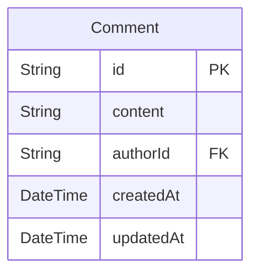
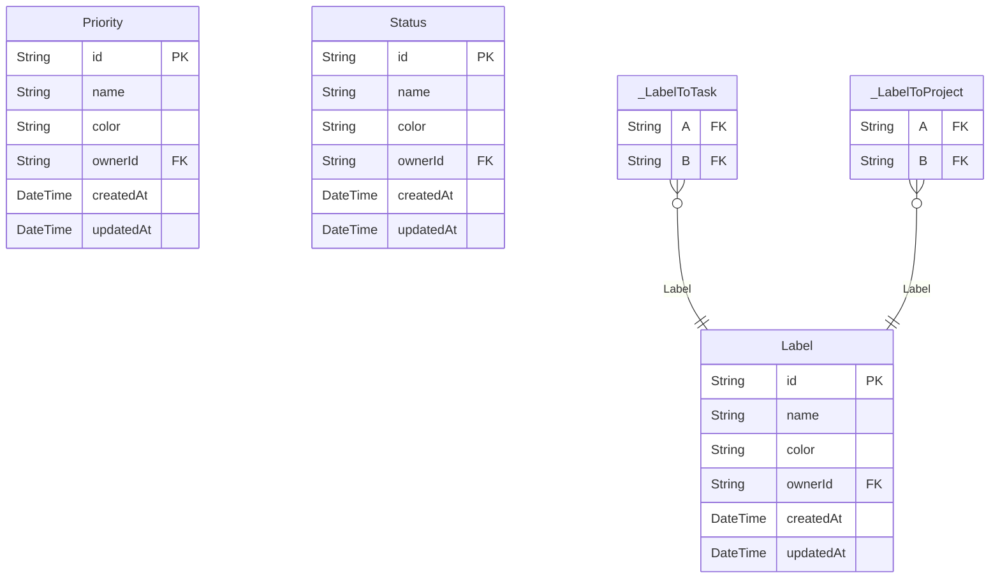
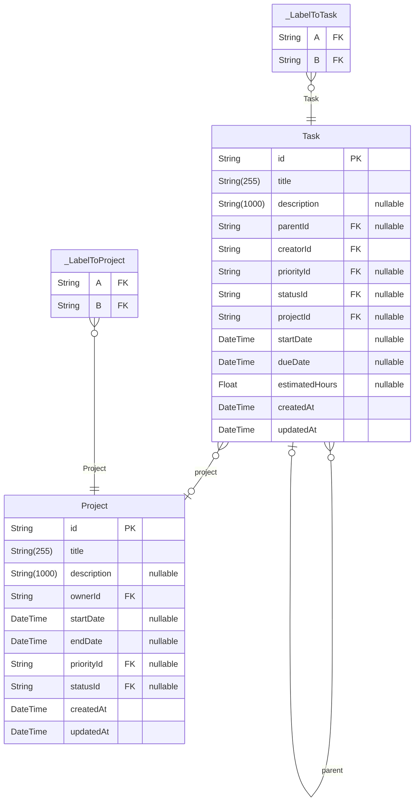
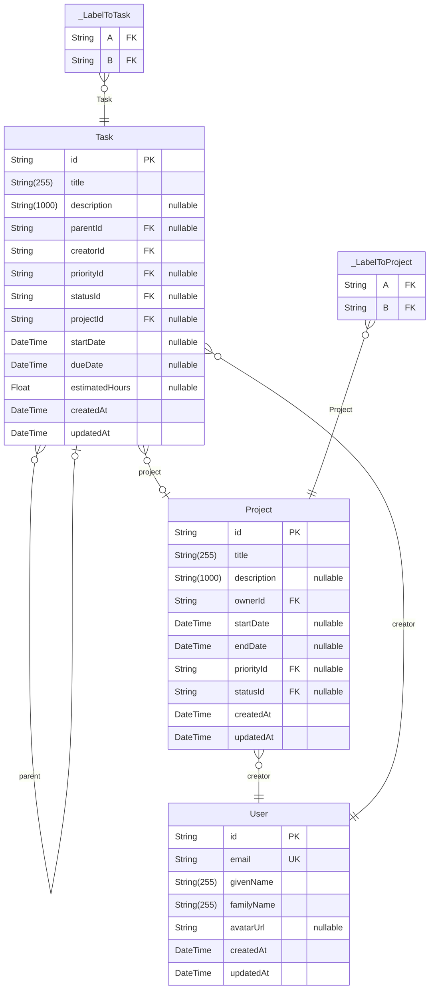
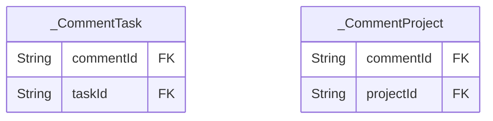

# Task Manager Database Schema

> Generated by [`prisma-markdown`](https://github.com/samchon/prisma-markdown)

- [Communication](#communication)
- [Taxonomy](#taxonomy)
- [Work](#work)
- [Core](#core)
- [Overview](#overview)
- [default](#default)

## Communication

### `Comment`

Represent a comment on a task or a project.

Properties as follows:

- `id`: Comment identifier (CUID).
- `content`: Comment content.
- `authorId`: Author user identifier (mapped to `creatorId`).
- `createdAt`: Creation timestamp.
- `updatedAt`: Last update timestamp.

## Taxonomy

### `Label`

Represents a reusable label for task categorization.

Properties as follows:

- `id`: Label identifier (CUID).
- `name`: Label display name.
- `color`: Label color (hex code).
- `ownerId`: Owner user identifier (mapped to `ownerId`).
- `createdAt`: Creation timestamp.
- `updatedAt`: Last update timestamp.

### `Priority`

Represents a reusable task priority.

Properties as follows:

- `id`: Priority identifier (CUID).
- `name`: Priority display name.
- `color`: Priority color (hex code).
- `ownerId`: Owner user identifier (mapped to `ownerId`).
- `createdAt`: Creation timestamp.
- `updatedAt`: Last update timestamp.

### `Status`

Represents a reusable task status.

Properties as follows:

- `id`: Status identifier (CUID).
- `name`: Status display name.
- `color`: Status color (hex code).
- `ownerId`: Owner user identifier (mapped to `ownerId`).
- `createdAt`: Creation timestamp.
- `updatedAt`: Last update timestamp.

### `_LabelToTask`

Pair relationship table between [Label](#Label) and [Task](#Task)

Properties as follows:

- `A`:
- `B`:

### `_LabelToProject`

Pair relationship table between [Label](#Label) and [Project](#Project)

Properties as follows:

- `A`:
- `B`:

## Work

### `Project`

Represents a project that groups related tasks.

Properties as follows:

- `id`: Project identifier (CUID).
- `title`: Project title.
- `description`: Optional project description.
- `ownerId`: Owner user identifier (mapped to `ownerId`).
- `startDate`: Optional project start date.
- `endDate`: Optional project end date.
- `priorityId`: Priority identifier.
- `statusId`: Status identifier.
- `createdAt`: Creation timestamp.
- `updatedAt`: Last update timestamp.

### `Task`

Represents a task work item.
Supports recursive nesting through parent-child relationships.

Properties as follows:

- `id`: Task identifier (CUID).
- `title`: Task title.
- `description`: Optional task description.
- `parentId`: Parent task identifier.
- `creatorId`: Creator user identifier.
- `priorityId`: Priority identifier.
- `statusId`: Status identifier.
- `projectId`: Projects associated with this task.
- `startDate`: Optional task start date.
- `dueDate`: Optional task due date.
- `estimatedHours`: Optional estimated effort in hours.
- `createdAt`: Creation timestamp.
- `updatedAt`: Last update timestamp.

### `_LabelToTask`

Pair relationship table between [Label](#Label) and [Task](#Task)

Properties as follows:

- `A`:
- `B`:

### `_LabelToProject`

Pair relationship table between [Label](#Label) and [Project](#Project)

Properties as follows:

- `A`:
- `B`:

## Core

### `Role`

Represents a role definition for future access control.

Properties as follows:

- `id`: Role identifier (CUID).
- `name`: Role display name.
- `color`: Role color (hex code).
- `ownerId`: Owner user identifier (mapped to `ownerId`).
- `createdAt`: Creation timestamp.
- `updatedAt`: Last update timestamp.

### `User`

Represents an application user.

Properties as follows:

- `id`: User identifier (CUID).
- `email`: User email address.
- `givenName`: Given name.
- `familyName`: Family name.
- `avatarUrl`: Optional avatar image URL.
- `createdAt`: Creation timestamp.
- `updatedAt`: Last update timestamp.

## Overview

## default

### `_CommentTask`

Join model linking comments to tasks with meaningful foreign key names.

Properties as follows:

- `commentId`: Comment identifier.
- `taskId`: Task identifier.

### `_CommentProject`

Join model linking comments to projects with meaningful foreign key names.

Properties as follows:

- `commentId`: Comment identifier.
- `projectId`: Project identifier.
